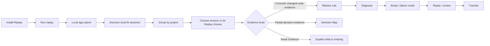
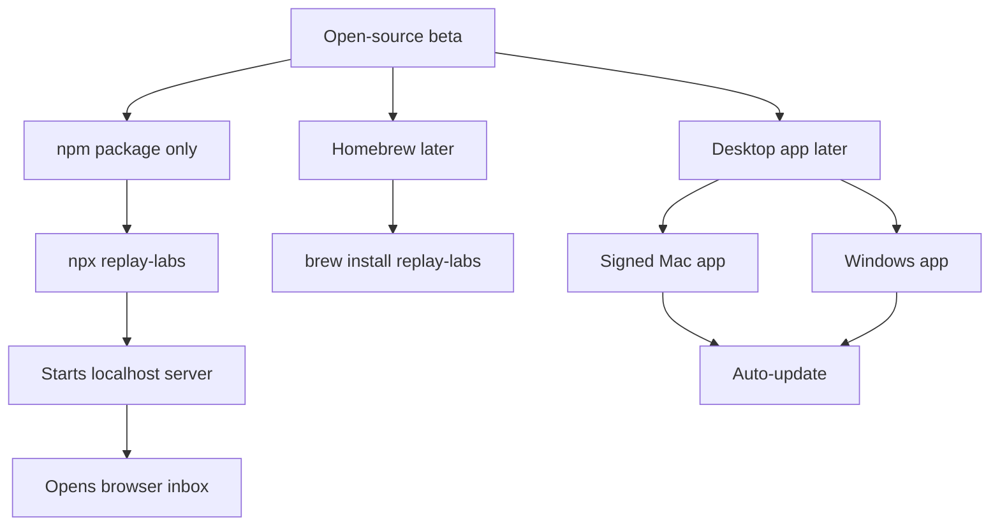
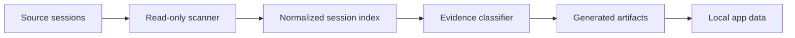
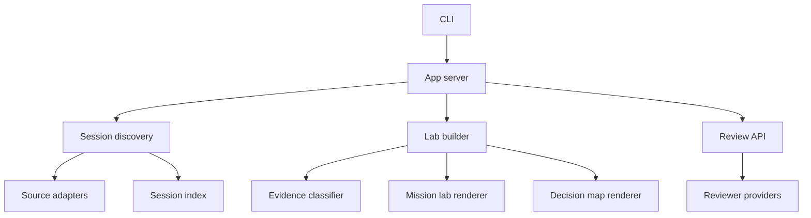

# Replay Labs Production And Open Source Plan

## Goal

Replay Labs should be installable by a stranger on their laptop.

They should be able to run one npm command, open a local web app, discover Claude and Codex sessions, choose a project, and turn one real AI work session into a mission-based lab or decision map without uploading or pasting private work.

The production bar is not "the demo works on our machine." The bar is:

> A user we do not know can install Replay, understand what it is doing, trust the local data model, and get a useful learning artifact from their own sessions.

## Product Shape



Replay Labs stays local-first. Cloud, accounts, sharing, Homebrew, and desktop apps can come later, but the first open-source release should not require them.

## Mission Standard

Mission mode is not a visual flourish. It is the learning contract.

Every lab should answer:

1. What decision does the user need to own?
2. What evidence from the session proves that decision mattered?
3. What breaks when the decision is missing or weak?
4. What repair or review standard would a stronger practitioner require?
5. What rule can the user carry into the next AI session?

The lab should avoid fake certainty. If Replay does not have enough changed-code evidence, it should say so and provide a decision map instead of pretending a full lab is ready.

## Install And Update Path



### First Release

- Publish as the npm package `replay-labs`.
- Provide `npx replay-labs` as the easiest start command.
- Auto-open the browser to the session inbox.
- Pick an open port automatically when the default is busy.
- Print clear local URLs and privacy language in the terminal.
- Keep Node support explicit. Current target: Node 20+.
- Do not require Homebrew, a desktop wrapper, an account, or a cloud service.

### Future App Updates

The app should be designed so updates do not corrupt local data or make old generated labs unreadable.

Required practices:

- Version local data schemas.
- Version generated lab payloads.
- Keep migration functions small and testable.
- Store generated artifacts in a predictable app data directory.
- Keep old static HTML labs viewable even if newer app features are unavailable.
- Add a release checklist before every public tag.

## Local Data Management

Replay Labs reads private developer session data. That makes local data handling part of the product, not an implementation detail.



### Read Sources

Initial supported sources:

- `~/.claude/projects`
- `~/.codex/sessions`

Future sources should be added through source adapters, not scattered conditionals.

### Store Locally

Use one app data root:

- macOS: `~/Library/Application Support/Replay Labs`
- Linux: `$XDG_DATA_HOME/replay-labs` or `~/.local/share/replay-labs`
- Windows: `%APPDATA%/Replay Labs`

Suggested structure:

```text
Replay Labs/
  index/
    sessions.v1.json
  labs/
    <session-slug>/
      manifest.v1.json
      index.html
      labs/
  cache/
    generated-modules/
  logs/
    replay.log
```

### Privacy Rules

- Never upload sessions by default.
- Never send session content to a model without an explicit user-controlled setting.
- Show whether review/generation is local, heuristic, or model-backed.
- Redact likely secrets before rendering snippets.
- Document every directory Replay reads and writes.

## Architecture Direction

The codebase should move toward clear boundaries:



### Target Modules

- `cli`: command parsing, startup, port selection, browser open.
- `server`: HTTP routes and API boundaries only.
- `sources`: Claude, Codex, future Cursor/Windsurf adapters.
- `sessions`: normalized session model and indexing.
- `evidence`: diff/transcript evidence classification.
- `labs`: mission lab generation and rendering.
- `maps`: decision map generation.
- `review`: reviewer providers and fallback behavior.
- `storage`: app data paths, cache, migrations.
- `ui`: static UI renderers until a frontend framework is justified.

## Code Quality And Contribution Standard

Open source contributors should find a codebase that is boring in the best way.

### Standards

- No noisy comments.
- No stale AI-generated narration.
- Comments only where they explain a non-obvious constraint.
- Small modules with clear ownership.
- Deterministic tests around evidence classification and rendering.
- No hidden network calls.
- No unrelated formatting churn in feature PRs.
- No broad rewrites without a migration reason.

### Contribution Files

Before public release, add:

- `CONTRIBUTING.md`
- `SECURITY.md`
- `CODE_OF_CONDUCT.md`
- `.github/workflows/test.yml`
- issue templates
- pull request template

### Review Bar

Every contribution should answer:

- Does this keep user data local by default?
- Does this make the lab more truthful or more useful?
- Does this preserve old generated artifacts?
- Does this have focused tests?
- Does this make the codebase easier to maintain?

## QA Matrix

```mermaid
flowchart TD
  A["QA Gate"] --> B["Install"]
  A --> C["Discovery"]
  A --> D["Inbox UX"]
  A --> E["Mission Lab"]
  A --> F["Data Safety"]
  A --> G["Regression"]

  B --> B1["npm pack install"]
  B --> B2["npx start"]
  B --> B3["port conflict"]

  C --> C1["Claude sessions"]
  C --> C2["Codex sessions"]
  C --> C3["No sessions"]
  C --> C4["Large session folder"]

  D --> D1["Project grouping"]
  D --> D2["Filters"]
  D --> D3["Mobile layout"]
  D --> D4["Empty/error states"]

  E --> E1["Ready lab"]
  E --> E2["Generated lab"]
  E --> E3["Decision map"]
  E --> E4["Review fallback"]

  F --> F1["Secret redaction"]
  F --> F2["No upload default"]
  F --> F3["Clear local paths"]

  G --> G1["Unit tests"]
  G --> G2["Browser smoke tests"]
  G --> G3["Visual screenshots"]
```



## Milestones

### Milestone 1: Installable Local Beta

Outcome: a user can run Replay locally from npm.

- Rename package for npm release.
- Add production CLI entrypoint.
- Auto-open browser.
- Add port conflict handling.
- Add app data directory helper.
- Add first-run empty state and privacy copy.
- Add npm-pack install smoke test.

### Milestone 2: Trustworthy Session Inbox

Outcome: users can navigate real sessions without confusion.

- Keep project grouping and filters.
- Add source/folder settings.
- Show evidence state honestly.
- Make progress and results appear in place.
- Add visual QA snapshots for desktop and mobile.
- Add tests for Claude/Codex balance and empty states.

### Milestone 3: Mission Lab Standard

Outcome: every full lab follows the mission contract.

- Make mission framing universal for hand-authored and generated labs.
- Remove awkward phrasing and forced adjectives.
- Reduce typing burden.
- Keep short written answers only where they prove understanding.
- Add lab completion artifact.
- Add tests for generated lab schema and mission sections.

### Milestone 4: Data Safety And Update Readiness

Outcome: local data is explicit, versioned, and safe to evolve.

- Add storage module.
- Add schema versions for index and lab manifests.
- Add redaction pass before rendering evidence.
- Add cache invalidation rules.
- Add migration tests.
- Document read/write directories.

### Milestone 5: Open Source Release

Outcome: public repo is ready for users and contributors.

- Update README for install-first flow.
- Add contribution and security docs.
- Add GitHub Actions.
- Add release checklist.
- Add example fixtures safe for public use.
- Tag first beta release.

## Definition Of Done For Public Beta

Replay Labs is public-beta ready when:

- A clean machine can run `npx replay-labs` successfully.
- The app opens without manual URL copying.
- Claude and Codex sessions are discovered when present.
- No-session state is useful.
- At least one real ready lab can be opened end to end.
- Decision-map-only sessions are not mislabeled as labs.
- Local data paths are documented.
- Tests pass in CI.
- Browser smoke QA passes on desktop and mobile.
- README explains privacy and limitations plainly.
- A contributor can understand the repo structure without asking us.
